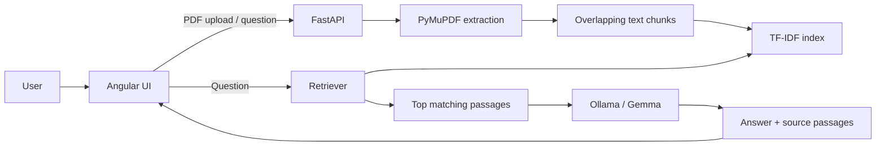

# Architecture

```mermaid
flowchart LR
    U[User] --> A[Angular UI]
    A -->|PDF upload / question| F[FastAPI]
    F --> P[PyMuPDF extraction]
    P --> C[Overlapping text chunks]
    C --> T[TF-IDF index]
    A -->|Question| R[Retriever]
    R --> T
    R --> X[Top matching passages]
    X --> G[Ollama / Gemma]
    G --> O[Answer + source passages]
    O --> A
```

The current demo uses a lexical TF-IDF retriever. A later iteration can replace it with semantic embeddings and a vector store.
